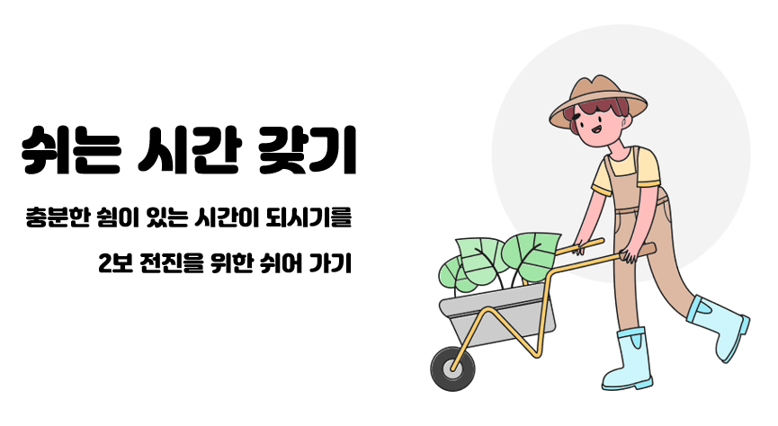
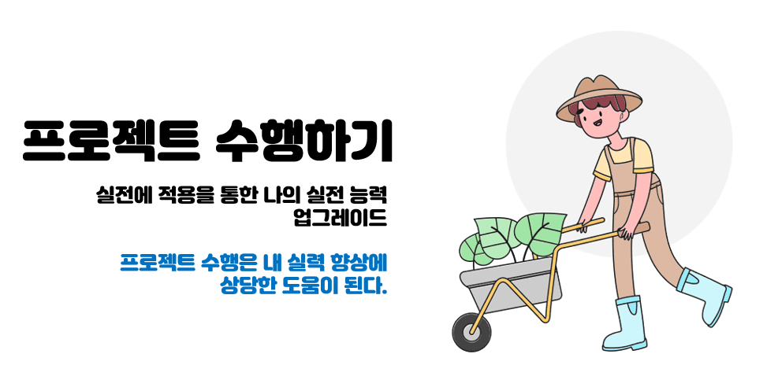
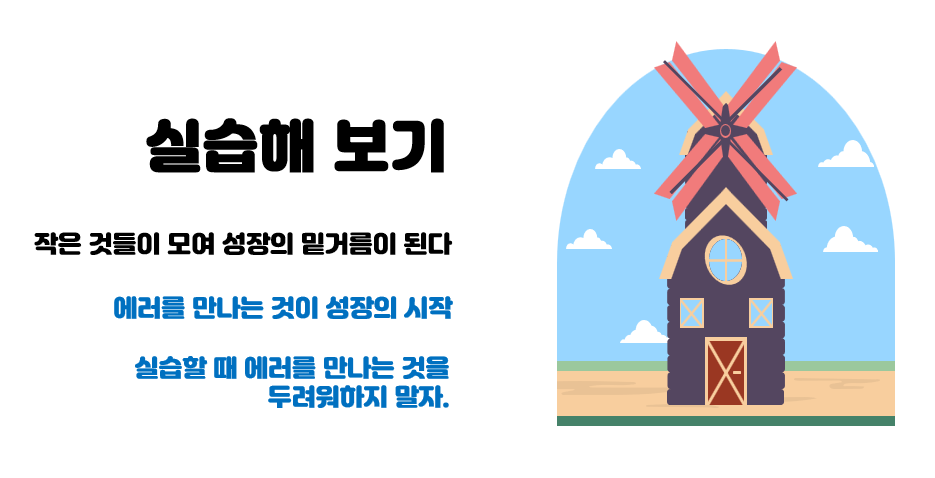

# Class 수업
https://ldjwj.github.io/ClassPage/

00:00:00

<button onclick="startStopwatch()">Start</button>
<button onclick="stopStopwatch()">Stop</button>
<button onclick="resetStopwatch()">Reset</button>

### 수업

 
 

 
 

